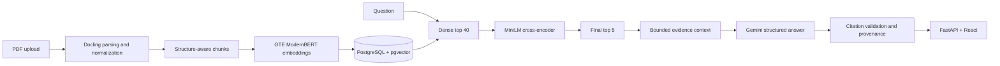

# Knowledge

Knowledge is a document-grounded question-answering project for PDFs. It parses a document's structure, retrieves relevant passages and tables, then answers with citations that link back to the stored source. I built it to make the difficult parts of RAG—parsing, evidence coverage, and grounded answers—visible and measurable rather than treating PDF upload as a single black box.

It is a production-style engineering project and local single-user application, not a hardened multi-user service.

## How it works



Docling output is normalized into pages, blocks, sections, tables, and source references. The chunker keeps section context and table content together. For damaged tables, the parser can conservatively recover text from native PDF geometry and records quality notes rather than silently presenting uncertain structure as clean data. Chunks are embedded with a pinned GTE ModernBERT revision and stored with their text and provenance in PostgreSQL.

Questions search only the selected document. Dense retrieval supplies up to 40 candidates; a pinned local MiniLM cross-encoder reranks them to five. `ContextBuilder` assigns evidence IDs such as `E1` and includes whole chunks within a fixed context budget. Gemini receives that evidence and returns a structured answer. The application checks citation syntax, evidence-ID membership, and citation order, then resolves page and section details from stored provenance—not model-written references. These checks prevent fabricated source IDs; they do not prove that every cited claim is factually supported.

The backend is FastAPI/Pydantic/SQLAlchemy/Alembic. The UI is React, TypeScript, and Vite. A local Qwen/Ollama provider is available for development; Gemini is the default answer provider.

## Evaluation

The development cycle was baseline → evaluate → inspect failures → make a targeted change → rerun. The retrieval evaluator labels each question with required facts and acceptable evidence locations, so it can distinguish finding *some* evidence from finding *all* evidence needed for an answer.

In a 45-question development evaluation, the same dense top-40 pool was compared before and after MiniLM reranking. These figures were reproduced with the pinned local models and a read-only PostgreSQL index on 22 September 2026:

| Retrieval metric | Dense top 5 | MiniLM top 5 |
| --- | ---: | ---: |
| AnyEvidence@5 | 84.4% | 95.6% |
| FullCoverage@5 | 80.0% | 93.3% |
| MeanFactCoverage@5 | 83.0% | 94.1% |
| MRR@5 | 0.675 | 0.819 |

The 45 questions covered three documents. The source documents and evaluation labels are not redistributed, so this table is a reported development result, not a benchmark a fresh clone can reproduce exactly. The evaluator and a small synthetic V2 dataset remain in the repository to show the method.

A separate manual end-to-end check asked nine fresh questions about the [VersionRAG paper](https://arxiv.org/abs/2510.08109), including prose, tables, numerical details, synthesis, scope distinctions, and an unanswerable question. Eight answers fully passed review; one missed part of the answer. No factual hallucination was observed, and the unanswerable question produced an insufficient-evidence response. This is a small manual observation, not a reliability estimate. The paper PDF and its evaluation labels are not included here.

## Run locally

You need Python 3.11, Node.js 20.19+ or 22.12+, Docker with Compose, and enough memory for the local embedding and reranking models. Their pinned weights may download on first use. Use only PDFs you are authorized to store and, when selecting Gemini, send to its API.

From the repository root, create the environment and database:

```sh
python3.11 -m venv .venv
source .venv/bin/activate
python -m pip install -e ".[dev]"
cp .env.example .env
docker compose up -d
alembic upgrade head
```

Set `GEMINI_API_KEY` in the ignored `.env` file or your shell environment. `.env.example` contains a placeholder, not a working key. The Compose credentials are for a localhost-only development database. To use local Qwen instead, install Ollama and `qwen3:8b`, then set `LLM_PROVIDER=local_qwen`; its tokenizer also needs to be available locally.

Start the backend:

```sh
source .venv/bin/activate
uvicorn brd_knowledge.main:app --reload
```

In another terminal, start the frontend:

```sh
cd frontend
npm ci
npm run dev
```

Open <http://127.0.0.1:5173>. Vite proxies `/api` to FastAPI on port 8000. Upload a PDF; the UI parses and saves it, then prepares its search index. Once the document is ready, choose a provider and ask a question. Upload, indexing, and generation are synchronous and can take time on a CPU-only machine.

## Checks and project layout

```sh
# Repository root
pytest -q
ruff check .
mypy src

# frontend/
npm test
npm run lint
npm run typecheck
npm run build
```

Three PostgreSQL integration tests require a separate `TEST_DATABASE_URL`; without it, pytest skips them. Automated tests mock Gemini rather than making billable requests.

- `src/brd_knowledge/`: parsing, chunking, embeddings, retrieval, context, generation, API, and persistence.
- `frontend/`: document upload, questions, answers, and source inspection.
- `migrations/`: PostgreSQL and pgvector schema changes.
- `scripts/`: inspection, indexing, question, and retrieval-evaluation utilities.
- `tests/`: unit tests, synthetic evaluation labels, and optional database integration tests.

## Limits and data handling

Knowledge has no user accounts, document-level authorization, background ingestion queue, or rate limiting. Keep it on a trusted local network; it is not ready for public uploads or confidential multi-user use. PDF parsing can be slow or incomplete, and a valid citation means the ID exists in the supplied evidence—not that the answer is complete or every claim is true. Gemini token counting and generation both transmit the selected evidence to the provider. Raw failed-generation payload logging is opt-in for local evaluation and may contain document text; keep it off for sensitive material.

The code is MIT licensed. Third-party PDFs and model weights are not covered by that license.
