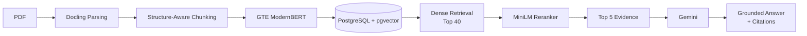

# Knowledge

Knowledge is a production-style RAG system for grounded question answering over complex PDFs.

It combines structure-aware document parsing, dense retrieval, cross-encoder reranking, and grounded generation with source citations. The project was built around a simple principle: **evaluate the pipeline, identify where it fails, and improve only what the evidence justifies.**

## Architecture



Documents are parsed while preserving structural and provenance information. At query time, dense retrieval produces a candidate set, a cross-encoder reranks the candidates, and the strongest evidence is passed to the generation layer. Citations returned by the model are validated and resolved back to trusted document metadata.

## Key Features

- **Structure-aware PDF parsing** with Docling and provenance preservation
- **Table-aware ingestion** with conservative recovery for difficult PDF layouts
- **Semantic retrieval** using GTE ModernBERT embeddings and PostgreSQL/pgvector
- **Cross-encoder reranking** with MiniLM over the dense candidate set
- **Grounded generation** using Gemini with structured outputs
- **Validated citations** mapped back to authoritative document evidence
- **Failure diagnostics and evaluation tooling** across retrieval and generation

## Evaluation

Retrieval was evaluated on a **45-question fact-aware benchmark** designed to measure whether the system retrieves all evidence required to answer a question, rather than simply matching a single relevant chunk.

| Metric | Dense Retrieval | + MiniLM Reranking |
|---|---:|---:|
| AnyEvidence@5 | 84.4% | **95.6%** |
| FullCoverage@5 | 80.0% | **93.3%** |
| MeanFactCoverage@5 | 83.0% | **94.1%** |
| MRR@5 | 0.675 | **0.819** |

The reranker was adopted only after evaluation showed consistent improvements over the dense baseline.

A separate manual end-to-end evaluation on **9 fresh questions** produced **8 full passes, 1 partial completeness result, and 0 observed factual hallucinations**. This was a small dogfooding exercise rather than a statistical reliability estimate.

## Tech Stack

**Backend:** Python, FastAPI, Pydantic  
**Parsing:** Docling, PyMuPDF  
**Retrieval:** GTE ModernBERT, MiniLM Cross-Encoder, pgvector  
**Database:** PostgreSQL, SQLAlchemy, Alembic  
**Generation:** Gemini  
**Frontend:** React, TypeScript, Vite  
**Testing:** pytest, Ruff, Mypy

## Running Locally

### 1. Install

```bash
python3.11 -m venv .venv
source .venv/bin/activate
pip install -e ".[dev]"
```

Copy the example environment configuration:

```bash
cp .env.example .env
```

Add your Gemini API key and configure the database connection in `.env`.

### 2. Start PostgreSQL

```bash
docker compose up -d
```

Run database migrations:

```bash
alembic upgrade head
```

### 3. Start the API

```bash
uvicorn brd_knowledge.main:app --reload
```

### 4. Start the frontend

```bash
cd frontend
npm install
npm run dev
```

The frontend will be available at `http://localhost:5173`.

## Tests

Backend:

```bash
pytest
ruff check .
mypy src
```

Frontend:

```bash
cd frontend
npm test
npm run lint
npm run typecheck
npm run build
```

## Design Philosophy

This project intentionally avoids adding retrieval techniques simply because they are popular.

The development loop was:

**baseline → evaluate → inspect failures → make one justified change → evaluate again**

For example, cross-encoder reranking was introduced only after the dense retrieval baseline had been measured and its failure cases analyzed.

## Current Limitations

Knowledge is a production-style engineering project, not a fully production-hardened multi-user service.

Current limitations include synchronous document ingestion, no multi-user authorization, no deployment-level rate or concurrency controls, and limited end-to-end evaluation. Selected document evidence is also transmitted to the configured external generation provider.

Citation validation verifies evidence IDs and provenance, but does not by itself guarantee that every generated claim is semantically supported.

## License

MIT